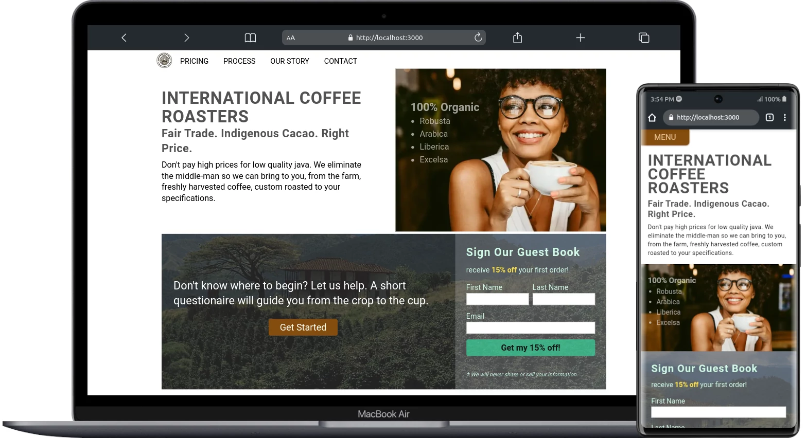

# INTERNATIONAL COFFEE ROASTERS

### Landing Page SEO

This project is an example landing page which was created using Next.js, React Hooks, React Reveal, and Tailwind CSS. Though this site is live, it does not have any live links. The purpose for developing this project was to showcase SEO best practices.  
As of now the SEO tests have not been performed, however those tests will be performed in the near future.
  
As you can see in the example image in this README.md, the site is fully mobile responsive, and has some dynamic changes that take place upon resizing.

## Contact Information

[Email](mailto://wlowrimore@gmail.com) 
[LinkedIn](https://www.linkedin.com/in/william-lowrimore-dev) 
[GitHub](https://www.github.com/wlowrimore)
